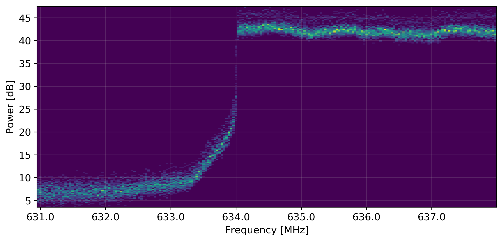
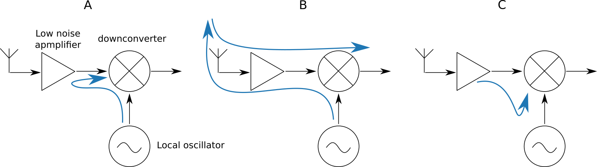

# INTRODUCTION

This thesis covers basic aspects of radio spectrum monitoring and some of its
applications in modern communication systems.

Spectrum monitoring, in a general sense, involves sensing and interpreting the frequency content
of a band of the radio spectrum over time.
The complexity of monitoring systems can vary from simple running time-averages
of a sensed spectrum to more complex systems that can, for example, decode signaling protocols,
store spectrum usage history, and analyze data either in real-time or in post-processing
to provide more information.\cite{gronroos16}\cite{ni-white-15}

The bulk of work in this thesis is the implementation of a radio spectrum monitoring system
consisting of a commercial software-defined radio peripheral and a Linux laptop with
custom application logic, post-processing, and data visualization scripts.

\clearpage

# BACKGROUND

## Spectrum Allocation

Conventionally, bands of the radio spectrum are allocated for use in a particular application, and the rights to transmit on those bands
are licensed by a governing body. Licensees may obtain licenses for
comparatively long spans of time, during which the allocated spectrum
might not be used continuously and in full.
Faster data transmission rates and widespread use of radio-based communications
means that the efficient use of the available spectrum is increasingly important, as it is a finite resource.\cite{subramaniam15}

The Finnish Communications Regulatory Authority (FICORA) is the governing
body that handles spectrum allocation in Finland. FICORA regulates the
use of frequencies 9 kHz -- 400 GHz.\cite{ficoraReg15}

The International Telecommunications Union (ITU) is a specialized agency of the United Nations that allocates
radio spectrum and satellite orbits. The ITU coordinates with national regulatory authorities
to maintain cross-compatible radio regulations globally.

Advances in radio technology allow the implementation of flexible
radio systems that reduce underutilization of available RF spectrum\cite{gronroos16}. Transmission
frequencies, bandwidth, and modulation schemes can be changed
in a dynamic way thanks to increased flexibility and accommodate for changes in the available
spectrum.  Spectrum monitoring is a key technology when considering the
use of dynamic spectrum access.\cite{zennaro12}

<!--  read hoyhtya16 and write something in this section-->

## Applications of Spectrum Monitoring

Spectrum monitoring, or spectrum occupancy measurement, is used to study how
effectively a frequency band of interest is used in some geographical area.
The level of use is determined based on the proportion of time when the
frequencies are in use versus them being unoccupied. Information obtained from
spectrum monitoring helps regulatory authorities assess the effectiveness their
current allocations, and plan for future use of the radio spectrum.
Spectrum monitoring is also used to improve the accuracy of spectrum usage
databases to facilitate sharing of spectrum.\cite{hoyhtya16}

### Opportunistic Spectrum access

<!-- A concrete example dynamic spectrum access is the secondary use of TV
whitespace (TVWS). In Finland -->

Opportunistic spectrum access refers to techniques that make it possible for radio systems to use frequencies in a flexible manner, by automatically changing transmission frequency or the time of transmission depending of were unoccupied spectrum can be found at any given moment.

#### Licensed Shared Access

Licensed shared access (LSA) is an approach to radio spectrum regulation
that allows further use of spectrum that is already allocated to
an incumbent user.  LSA is based on a framework where the incumbent user, one or more LSA licensees -- i.e new users,
and the spectrum regulation authority collectively agree on a sharing scheme. The sharing
scheme in LSA is controlled in a way that both the incumbent user, as
well as the licensee can expect predictable quality-of-service and are
protected from interference.\cite{lsa}

Availability information and spectrum access policies are held centrally
in an LSA repository. Spectrum monitoring is a key component for implementing
a system such as LSA.

<!-- ### Enforcement of Radio Regulation -->

## Spectrum Sensing Methods

<!-- TODO: this section -->

<!-- ### Energy Detection -->

<!--  subramanima15 has references to sensing studies --> <!-- "using
the energy detection method with fixed-threshold [9]"\cite{subramaniam15}
-->

Energy detection is commonly used in research applications to determine
the utilization of radio frequencies. In a
simplistic application, energy detection can be done by digitizing a band
of the spectrum using a software defined radio, or a purpose-built spectrum
analyzer.  A binary decision about whether a particular frequency is in
use is made by comparing the received RF energy on that frequency to a
fixed threshold value.\cite{subramaniam15}

Energy detection using a fixed threshold is problematic.  Threshold values
that are set manually are error prone, and may need re-adjustment
depending on the environment in which measurements are done.
A threshold that is set too high will cause false negatives when
a signal that is present is not strong enough to pass the threshold.
Similarly, if the threshold value is too low, false positives may be
triggered by noise, whether man-made or otherwise, that exceeds the
threshold.\cite{subramaniam15}

###

Mathematically more complex and compute-intensive methods relying on
autocorrelation and correlation distance based algorithms are also used
besides energy detection. These techniques have the advantage of producing
more reliable results in environments that change over time, as they can account
for the changes.
Even a spectrum monitoring node located in a fixed geographical location may
observe changes in the noise level in the surrounding environment. Changes can
occur on different time scales, anything from momentary spurious emissions from
radio-based communication systems, differences in man-made noise depending on the
time of day or events on longer time spans such as new buildings being constructed
in an urban area.\cite{subramaniam15}\cite{gronroos16}

To maintain long-lasting spectrum occupancy measurements or a viable network of spectrum monitoring sensors, it is important that
monitoring nodes can operate without the intervention of a technician.
Needing to constantly update detection thresholds on monitoring sensors
is time-consuming and error prone. Using more intelligent decision-making
algorithms increase the quality of the data produced by a measurement
campaign.\cite{gronroos16}

Sensing applications can be either generalized or designed for
a specific transmission type, to monitor the use of particular of a
radio system. Energy detection, autocorrelation, and correlation distance based
system are generalized techniques for determining occupancy. A system-specific
monitoring application may be able to provide more useful information about the
use of a spectral band compared to a general solution by demodulating and decoding
signals to determine eg. the number of timeslots used in a time-domain
multiplexed communications network. Having free timeslots available means,
that while the band is technically occupied, there is still throughput
capacity available in the network.\cite{hoyhtya16}

## Software Defined Radio

An ideal software-defined radio peripheral is in simple terms a fast analog-to-digital converter (ADC) that's
attached to an antenna. SDR peripherals are used to digitize a band
of the radio spectrum which is then either processed in real-time, or it can be
written to non-volatile storage and processing of data can happen at a later stage.

In an ideal SDR solution, the antenna would be essentially connected
directly to the ADC. In actual applications, it is
necessary to use an RF front-end. Typical parts of such a
front-end include a band select filter, a low-noise amplifier (LNA),
and a mixing stage. The signal conditioning done by the front-end is needed to
shift the wanted signals to lower frequencies so that they are within the
bandwidth limit of the ADC.\cite{raman15}

\clearpage

# MATERIALS AND METHODS

This section describes the implementation of a radio spectrum monitoring system using an NI USRP as the antenna
interface. The application logic of the spectrum monitor was implemented in the
Python\cite{python_software} scripting language by utilizing the open-source
GNURadio\cite{gnu_radio_software} software suite and adjacent code libraries for DSP algorithms,
visualization, and controlling the USRP.

## The Universal Software Radio Peripheral

The USRP is a platform that is designed for research applications,
and it is evident based on earlier research publications
that is suitable for spectrum sensing applications.\cite{ni-white-15}\cite{angrisani16}

The majority of practical work in this thesis was done using a USRP-2932.

The USRP has an FPGA that can be used for simple signal processing.
however, due to the small size of the FPGA, it is limited in
its capability and cannot be used to implement complex physical layer (PHY) layer DPS
blocks for signal decoding. The FPGA's main purpose is to do resampling
and type conversion of the digitized signal as well as handle
network communication with the host PC, sample streaming, and
control the RF daughterboard\cite{ni-forum-question}\cite{ettusN210}

## Data flow

The USRP's center frequency is incremented at regular intervals to complete
full scans of a wide band of the spectrum.
An FFT is calculated and stored for each hop during the scan.

The difference in the center frequency of each consecutive hop is slightly less
than what the width of each FFT. This overlap between FFTs can be used to improve
data quality by discarding some of the lowest and highest frequency FFT bins,
which may suffer from roll-off.

## Data model

The scan data is represented as a tabular data structure where each row
represents a single FFT bin.

The columns in the data structure are

- \itab{date:  }   \tab{    a timestamp with millisecond accuracy}
- \itab{center:  } \tab{      the center frequency to which the USRP was tuned}
- \itab{freq:  }   \tab{    frequency of the FFT bin}
- \itab{power  }    \tab{ power magnitude of the FFT bin}
<!-- - noise: the power of the low*    *TODO** deprecate this bullet point** -->
<!-- these are scan and sweep in the actual source code -->
- \itab{hop:}   \tab{ which incremental hop of a scan the FFT bin belongs to}
- \itab{scan:}  \tab{ which incremental scan the hop of the FFT bin belongs to}

Representing the data in the described manner allows for easy manipulation
of the data with existing tools at the cost of increased data set size due
to redundancy.

Developing a more storage-efficient data model is outside the scope of work
for this thesis.

## Data storage on disk

The collected spectrum data can be stored long-term in plain text files as
comma separated tabular data in .csv files. This makes it easy to import the data into
a large variety of applications for post-processing.

Alternatively, the data can be stored in a more compact way using python's native
pickle storage. This is in order to collect data over long periods of time
without being constrained as much by storage space limitations.

<!--  CAN IT, THOUGH? -->
<!-- The USRP is capable of streaming up to 50 MSPS over Gigabit Ethernet\cite{ettusN210}, which is a high enough sample rate that the entire LTE 800 DD band, which covers a 30 MHz span at 791 – 821 MHz\cite{ficoraAlloc15} can be captured by a single FFT. -->

## Choosing the sample rate.

What sample rate is chosen impacts the speed of scanning and the available frequency
resolution.

The USRP is able to stream complex samples over its Gigabit Ethernet interface
at rates of up to 50 MSPS at an 8-bit resolution and 25 MSPS at a 16-bit resolution.
The resolution of the 16-bit samples is 14-bit in practice, which is the accuracy of the ADCs used for sample acquisition.\cite{ettusN210}

An 8-bit sample refers to a sampling scheme where 8 bits are used to each of the
I and Q sample, making the I/Q sample pair a total of 16 bits is size. Similarly an
I/Q pair of 16-bit samples 32 bits in size.

The USRP and GNURadio ecosystems for signal processing primarily use I/Q-sampling
when representing waveforms digitally.
The Nyquist frequency for complex sampling is equal to the complex sample rate.
In this context, passband width is often shown as the same value as the signal sample rate.
In fact, passband width is often referred to as the sample rate.

## CIC roll-off

Cascaded integrator-comb filters, CIC filters for short, are a class of hardware-efficient
finite response filters that are used for decimation and interpolation of a signal.\cite{donadio2000}

The USRP's integrated FPGA processes samples at 100 MSPS from the antenna ADC.
The samples are downsampled to a lower sample rate to transfer them
over the Gigabit Ethernet interface to the computer using a CIC filter.

The chosen sample rate has a significant impact on the quality of the scan data.
Choosing an inappropriate sample rate will cause the data to have CIC roll-off
artifacts from the filter that is involved in the down sampling.

The input sample rate to output sample rate ratio of the conversion needs to be even in
order to avoid CIC roll-off:

$$\cfrac{rate_{in}}{rate_{out}} \mod 2 = 0$$

The CIC roll-off is at its worst when the ratio is odd.

#### CIC roll-off measurements

The measurements shown in figure \ref{fig:cic-rolloff} show the manifestation of CIC roll-off
at two distinct sample rates. The resampling is done from 100 MSPS, making
the rate ratios are 100  MSPS / 20  MSPS} = 5 (odd) and
100 MSPS / 25 MSPS = 4 (even)

The sample rates 20 MSPS and 25 MSPS were chosen to show the most extreme and
least extreme cases of CIC roll-off while still maintaining the highest
available sample rate, in this case, using 16-bit samples. Choosing a high sample
rate allows for measuring a wider band of the spectrum at once, which is desirable
in the context of the spectrum monitoring application presented in this thesis.

{ width=100% }

Measurement configuration:

- \itab{radio peripheral:}  \tab{USRP-2932}
- \itab{host interface:}    \tab{Gigabit Ethernet}
- \itab{FPGA DSP rate:}     \tab{100 MSPS}
- \itab{I/Q sample rate:}   \tab{25 MSPS, 20 MSPS}
- \itab{I/Q sample depth:}  \tab{16-bit}
- \itab{load:}              \tab{50 ohm RF terminator}

The carriers visible in the center of plotted spectra in figure \ref{fig:cic-rolloff} are
DC offset artifacts caused by phenomenon unrelated to CIC roll-off.

The measurements verify what should be there, in theory, is observable in
practice.

## Frequency Resolution

Sample rate and FFT size (bin count) determine the greatest available resolution
in the frequency domain.

The frequency resolution is given by

$$ resolution \text{ [Hz]} = \cfrac{samplerate \text{ [Hz]}}{FFT size} $$.

That is to say, by capturing a narrower band of the spectrum, it is possible
achieve more granular frequency resolution with the same amount of computation.

Increasing the number of bins in an FFT increases the amount of computation required.
It is possible to save the raw I/Q samples to disk, and compute the large FFTs in a post-processing step where real-time computation is not required. In this case, a likely bottleneck
will be storage space. The lowest sample rate supported by `uhd_rx_cfile` is approximately
0.2 MPSP, which will produce close to 0.8 MB of data per second when using 16-bit
samples.
The maximum sample rate 25 MSPS produces 100 MB data per second.

GNURadio and Baudline\cite{baudline-software} both require the FFT sizes to be
powers of two ($2^n$), due to the algorithms used.

Major factors limiting sample rate are the rate of the SRD peripheral's ADC,
throughout available for transferring samples the host PC, and the
computational load that has to occur in real-time on the host PC.

### Frequency Resolution Measurement

{ width=100% }

Raw I/Q samples were recorded with a USRP into a file using the `uhd_rx_cfile` program that is part
of the USRP + GNURadio ecosystem. The samples were recorded at 0.2 MPSP, a rounded
sample rate close to the lowest supported sample rate, which is 0.195312 MSPS.

The recorded files do not contain any metadata about sample types or sample rates,
only the raw sample values. The following settings were used to read the recorded files
into baudline:

- \itab{decompression:  }  \tab{  off}
- \itab{initial byte:   }  \tab{  0}
- \itab{sample rate:    }  \tab{  custom, 200000 samples per second}
- \itab{channels:       }  \tab{  2, quadrature, flip complex}
- \itab{decode format:  }  \tab{  32-bit float}
- \itab{normalization:  }  \tab{  1.0}
- \itab{transform size: }  \tab{  65536}

The absolute minimum resolution in the frequency domain with the given configuration is

$$200000 \text{ Hz} / 65536 \approx 3.05 \text{ Hz}$$.

Figure \ref{fig:baud50} shows that Baudline is capable of distinguishing between
distinct peaks 50 Hz apart. 20 Hz and 15 Hz gaps could be also observed during the test,
although at times this required choosing a different windowing mode for the FFT, and even then
the results were not always consistent.

While the FSH4 spectrum analyzer and the USRP are both capable of measuring
the spectrum of the test signal, the main difference comes in temporal resolution.
The FSH4 used 7.8 seconds to obtain a single measurement of a 570 Hz span of spectrum
when measured at approximately the same 3 Hz frequency resolution as the USRP.
FFTs can be computed for each individual new sample when recording I/Q samples with an SDR peripheral such as the USPR.
In theory, this means the temporal resolution
at which FFTs can be obtained in this example is 1/200000 Hz = 0.000005 s.

## Visualization & Interpretation

The spectrum monitoring system presented in this thesis includes a visualization mechanism for showing histograms
of spectrum usage over time. As the name implies, histograms can be used to display the distribution of measured data points over time in a single graph.

{ width=100% }

Figure \ref{fig:hist-DVB} shows the spectrum histogram at the low-frequency edge of a Digital Video Broadcast (DVB) signal.
The histogram shows no data points at the noise floor's level (around  7 dB) above
frequencies of the DVB signal's lower edge at  634 MHz, which means the signal
was likely to be present 100% of the time. It is not guaranteed that the signal
was present at all times, as there is a delay between each time the spectrum is
measured, making it possible for a signal to not be present for a short while
and return before the next measurement is made.
Shortening the delay, therefore increasing the temporal resolution, is foremost
a tradeoff in data set size and required computational power.

Increasing the temporal resolution will increase the number of measurements, hence
increasing data size. Digitized signal waveform has to be processed on the host
PC before completing each measurement.
More computation power helps with increasing temporal resolution by speeding up
the waveform processing.

{ width=100% }

{ width=100% }

Figure \ref{fig:hist-mobile} shows a measurement of a band of spectrum used for mobile communication.
The power distribution shows a visible noise floor within the
allocated frequency band, which indicates that the frequencies are not
constantly in use and there are periods of time where no signals are present.
Figure \ref{fig:avg-mobile} shows the same spectrum measurement represented as a time-average plot
of the power.
The partial absence of signals in this example is not clearly visible in the type of running time-average typically
found in traditional spectum analyzers. The intermittent use of the band shows up as lower average power, but the band still
seems constantly occupied over time.

{ width=100% }

Figure \ref{fig:hist-long} showcases a wide-band data set which
was obtained by scanning the band and stitching several consecutive measurements into one dataset.

\clearpage

# DISCUSSION

## Protecting the radio peripheral

An inherent quality of radio spectrum monitoring applications is that receiver
equipment needs to be able to cope with very high-power transmissions in order
to have a robust system. When tuning the monitoring system to a certain
band, one can not be certain of what signals will be present at those frequencies.

In spectrum monitoring, it is often desirable to be able to record the presence of signals
regardless of their power. A general monitoring application may not have given standardized specifications
to conform to in the same manner as a traditional receiver purpose-built for a specific
communications application.
A purpose-built receiver doesn't necessarily need to work with signal strengths
that are too low or too high to conform with the expected signal strengths given
in the application's standard. Out-of-spec signals can be rejected and ignored.

Simplified measurement of the RF energy on present on a band can be done on an
attenuated version of the signal to set the receiver's gain to an
appropriate level and protect the monitoring system from damage caused by high-power signals.

This added level of protection may come at the expense of performance, as sensing
the power of a band and setting the receiver gain before tuning the radio peripheral
to the band in question will some amount time. This time can accumulate
if the system is used to scan a wide band of spectrum by constantly re-tuning the radio peripheral,
making each full scan take longer.

## DC-offset

It's common to see an interference artifact at the center of the band captured by a software defined radio.
The interference is a DC-offset caused by the direct-conversion receiver in the RF front-end which downmixes signals to the baseband before digitizing the signal. This phenomenon was observed with different software-defined radio peripherals including the NI USPR-2932, and two different
commercial DVB-T -tuner style radios.

Strong local signals or the receivers own local oscillator (LO) can self-mix with itself down to zero-IF, which causes the DC-offset.

LO leakage, LO re-radiation, and having strong in-band interference are the main mechanisms causing DC-offset\cite{raman15}.
The LO is relatively strong signal in order to accomplish mixing in the downconverter.
The LO signal can leak through unintended paths into the LNA in the in the front-end, where
it reflects back and is fed into the downconverter where it is mixed with itself and
causes a DC signal in the downconverter's output. The interference can be even stronger
it the LO leaks into the LNA's input and is therefore amplified before self-mixing.\cite{raman15}

The LO signal can unintentionally end up radiating from the receiver's antenna and
end up reflecting the signal from the environment back into the receiver's RF front-end.
Fading and multipath propagation can cause the reflected LO signal's strength
to change quickly, causing the DC-offset's level to vary over time.\cite{raman15}

Strong external interference at the LO's frequency can also cause DC-offset.
The radiated LO signal of a similar nearby receiver is one example of a source
for such interference.\cite{raman15}

DC-offset is caused in the SDR peripheral's RF front-end and is hardware-dependent.
The root causes for DC-offset cannot be corrected by choosing different digitizing
parameters in the way eg. CIC roll-off can be, although they can be corrected for
using DSP after the fact.

\clearpage

# CONCLUSION

The initial goal of the work done for this thesis was to develop a radio spectrum monitoring system using a National Instruments USRP.
The implemented spectrum monitoring system was tested
and implements the intended features. Much of the benefit
in the work done was not in the implementation itself but in the
process thereof: in researching available tools, figuring out how
to integrate them, and learning how software-define radio ecosystems
work on a lower abstraction level.
Running into issues and unexpected
measurement results during the development process prompted
tangential projects into researching what configuration parameter
or circuit is the root cause behind some phenomenon. Much of that knowledge
is applicable in other software-defined radio and general RF system
even outside the context of spectrum monitoring.
