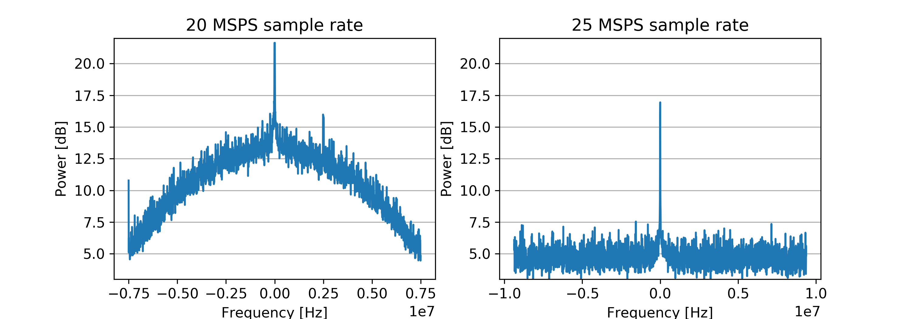

# Introduction

This thesis covers basic aspects of radio spectrum monitoring and some of its
applications in modern communication systems.

The bulk of work in this thesis is the implementation of a radio spectrum monitoring system
consisting of a commercial software defined peripheral and a Linux laptop with
custom application logic, post-processing and data visualization scripts.

# Background

<!--------------------------- section deprecated, irrelevant to thesis -------

## The 800 MHz band
- http://www.cellular-news.com/story/43196.php
- https://tech.ebu.ch/news/ec-makes-official-recommendation-for-790-29oct09

## Orthogonal Frequencies-Division Multiplexing

OFDM is used in most contemporary communication systems, including cellular standards such as WiMax and LTE Advanced, digital broadcasting such as DVB-T, and several IEEE 802.11 standards.\cite{bloessl13}

- http://niviuk.free.fr/lte_bandwidth.php good source for

This section is based on \cite{lte-ofdm-ofdma-scfdma}
http://www.radio-electronics.com/info/cellulartelecomms/lte-long-term-evolution/lte-ofdm-ofdma-scfdma.php

Multiple closely spaced carriers are modulated with a low data rate. Using orthogonal modulations means there is no mutual interference between the closely spaced carriers.

OFDM can also be used with TDD and FDD (division duplex? **TODO**)

The band consists of:

- B18  (800 Lower)
- B19  (800 Upper)
- B20  (800 DD)

> The channel bandwidths that have been chosen for LTE are:
>
> - 1.4 MHz
> - 3 MHz
> - 5 MHz
> - 10 MHz
> - 15 MHz
> - 20 MHz
>
> In addition to this the sub-carriers spacing is 15 kHz, i.e. the LTE subcarriers are spaced 15 kHz apart from each > other. To maintain orthogonality, this gives a symbol rate of 1 / 15 kHz = of 66.7 µs.
>
> Each subcarrier is able to carry data at a maximum rate of 15 ksps (kilosymbols per second). This gives a 20 MHz > bandwidth system a raw symbol rate of 18 MSPS. In turn this is able to provide a raw data rate of 108 Mbps as each symbol using 64QAM is able to represent six bits.
>

-->

## Spectrum Monitoring

Conventionally sections of radio spectrum are allocated for use in a
particular application, and the rights to transmit on those section
are licensed by a governing body. Licensees may obtain licenses for
comparatively long spans of time, during which the allocated spectrum
may not be used used continuously and in full. \cite{subramaniam15}

The Finnish Communications Regulatory Authority (FICORA) regulates the
use of frequencies 9 kHz -- 400 GHz \cite{ficoraReg15}.

Advances in radio technology allows the implementation of flexible
radio systems that reduce under utilization of available RF spectrum
\cite{gronroos16}.  Thanks to increased flexibility, transmission
frequencies, bandwidth, and modulation schemes can be changed rapidly
in a dynamic way in order to accommodate for changes in the available
spectrum.  Spectrum monitoring is a key technology when considering the
use of dynamic spectrum access \cite{zennaro12}.

<!--  read hoyhtya16 and write something in this section-->

## Applications of Spectrum Monitoring

### Opportunistic Spectrum access

A concrete example dynamic spectrum access is the secondary use of TV
whitespace (TVWS). In Finland

### Enforcement of Radio Regulation

## Licensed Shared Access

Licensed shared access (LSA) is an approach to radio spectrum regulation
that allows further use of spectrum that is previously allocated to
an incumbent user.  LSA is based on a framework where the incumbent
user, one or several LSA licensees -- i.e new users, and the spectrum
regulation authority collectively agree on a sharing scheme. The sharing
scheme in LSA is controlled in a way that both the incumbent user, as
well as the licensee can expect predictable quality-of-service and are
protected from interference. \cite{lsa}

Availability information and spectrum access policies are held centrally
in an LSA repository. An LSA controller communicates with the LSA repository

## Spectrum Sensing Methods

<!-- TODO: this section -->
Sensing applications can be either generalized, or designed for a
specific type of transmission, in order to monitor the use of particular
standardized channels of a radio system.

### Energy Detection

<!--  subramanima15 has many references to sensing studies --> <!-- "using
the energy detection method with fixed-threshold [9]" \cite{subramaniam15}
-->

Energy detection is commonly used in research applications to determine
the utilization of radio frequencies \cite{subramaniam15}.  In a
simplistic application energy detection can be done by digitizing a span
of spectrum using a software defined radio, or a purpose-built spectrum
analyzer.  A binary decision about whether a particular frequency is in
use is made by comparing the received RF energy on that frequency to a
fixed threshold value. \cite {subramaniam15}

Energy detection using a fixed threshold is problematic.  Threshold values
that are set manually are error prone, and may need re-adjustment
depending on the environment in which measurements are done.
A threshold that is set too high will cause false negatives, when a
signal that is present is note strong enough to pass the threshold.
Similarly, if the threshold value is too low, false positives may be
triggered by noise, whether man-made or otherwise, that exceeds the
threshold. \cite{subramaniam15}

<!--  see subramaniam15 reference [12] for more -->

### Autocorrelation

Autocorrelation function (ACF)

<!--  see subramaniam15 reference [13] for more -->

### Correlation Distance

## Software Defined Radio

A software defined radio peripheral is in simple terms a fast ADC that's
attach to an antenna. SDR platforms are used to digitize a sections
of spectrum which is then either processed in real-time, or it can be
written to non-volatile storage and processing of data can happen at a
later stage.

In an optimal SDR solution the antenna would be essentially connected
directly to the ADC. However, in actual applications it is usually
necessary to implement a radio front end. Typical parts of such a
front end include a bandpass filter (BPF), a low-noise amplifier (LNA)
\cite{needed}

# Materials and Methods

A radio spectrum monitoring system was implemented using an NI USRP as the antenna
interface. The application logic the spectrum monitor was implemented in the
Python \cite{python_software} scripting language by utilizing the open-source
GNU radio \cite{gnu_radio_software} software suite and adjacent code libraries for DSP algorithms,
visualization, and controlling the USRP.

## The Universal Software Radio Peripheral

The USRP is a platform that is designed for research applications
\cite{needed}, and it is evident based on earlier research publications
that is suitable for spectrum sensing applications \cite{angrisani16}.

The USRP has an FPGA that can be used for simple signal processing,
however due to the relatively small size of the FPGA, it is limited in
it's capability, and cannot be used to implement complex PHY layer DPS
blocks. \cite{ni-forum-question}

## Data flow

Full spectrum scans are completed by incrementing the USRP's center frequency at
regular intervals. An FFT is calculated and stored for each hop during the scan.

The difference in the center frequency of each consecutive hop is slightly less
than what the width of each FFT. This overlap between FF Ts can be used to improve
data quality by discarding some of the lowest and highest frequency FFT bins,
which may suffer from CIC-roll-off.

## Data model

The scan data is represented as a tabular data structure where each row
represents a single FFT bin.

The columns in the data structure are

- date: a timestamp with millisecond accuracy
- center: the center frequency to which the USRP was tuned
- freq: frequency of the FFT bin
- mag: power magnitude of the FFT bin
- power: sensed
<!-- - noise: power of the low*    *TODO** deprecate this bullet point** -->
<!-- these are scan and sweep in the actual source code -->
- hop: which incremental hop of a scan the FFT bin belongs to
- scan: which incremental scan the hop of the FFT bin belongs to

Representing the data in the described manner allows for easy manipulation
of the data with existing tools at the cost of increased dataset size due
to redundancy.

Developing a more storage-efficient data model is outside the scope of work
for this thesis.

## Data storage on disk

The collected spectrum data can be stored long-term in plain text files as
comma separated tabular data in .csv files. This makes it easy to import the data into
a large variety of applications for post-processing.

Alternatively, the data can be stored in a more compact way using python's native
pickle storage. This is a In order to collect data over long periods of time,

<!--  CAN IT, THOUGH? -->
<!-- The USRP is capable of streaming up to 50 MSPS over Gigabit Ethernet\cite{ettusN210}, which is a high enough sample rate that the entire LTE 800 DD band, which covers a 30 MHz span at 791 – 821 MHz \cite{ficoraAlloc15} can be captured by a single FFT. -->

## Choosing the sample rate.

What sample rate is chosen impacts the speed of scanning and the frequency
resolution that are available.

The USRP able to stream complex samples over its Gigabit Ethernet interface
at rates of up to 50 MSPS at 8-bit resolution and 25 MSPS at 16-bit resolution.
The resolution of the 16-bit samples is 14-bit is practice, which is the maximum
accuracy of the ADCs used for sample acquisition. \cite{ettusN210}

The USRP and GNURadio ecosystems for signal processing primarily use IQ-sampling
when representing waveforms digitally.
The Nyquist frequency for complex sampling is equal to the complex sample rate.
Therefore in this context, passband width is often show the same value as the signal sample rate.
In fact, passband width is often to simply as sample rate. \cite{needed}

### CIC-roll-off

Cascaded integrator-comb filters, CIC filters for short, are a class of hardware-efficient
finite response filters that can be used for decimation and interpolation of a signal \cite{donadio200}

The USRP's integrated FPGA processes samples at 100 MSPS from the antenna ADC.
The samples are down sampled to a lower sample rate in order to transfer them
over the Gigabit Ethernet interface to the computer using a CIC filter.

The chosen sample rate has significant impact on the quality of the scan data.
Choosing an inappropriate sample rate will cause the data to have CIC-roll-off
artifacts from the filter that is involved in the down sampling.

The input sample rate to output sample rate ratio of the conversion needs to be even in
order to avoid CIC-roll-of. The CIC-roll-off is at its worst when the ration is odd

$$\cfrac{R_{in}}{R_out} \mod 2 = 0$$

The measurements in \ref{fig:cic-rollof} shows the manifestation of CIC-roll-off
at two distinct sample rates. The resampling is done from 100 MSPS, therefore
the rate rations are $100 \text{ MSPS} / 20 \text{ MSPS} = 5$ and
$100 \text{ MSPS} / 25 \text{ MSPS} = 4$

CIC (cascaded integrator-comb)

# Discussion

# Further development

# Conclusion
