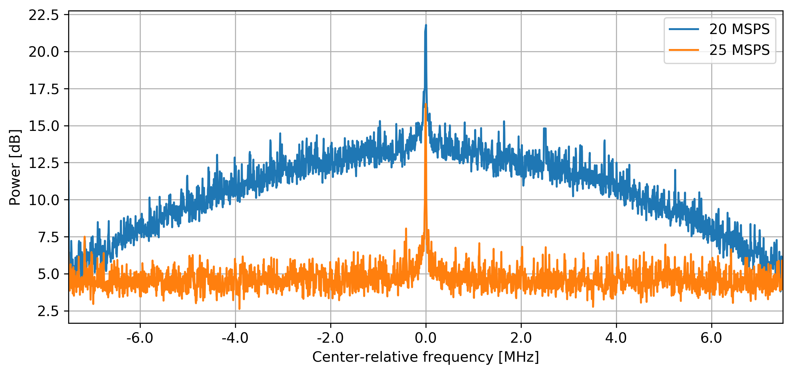
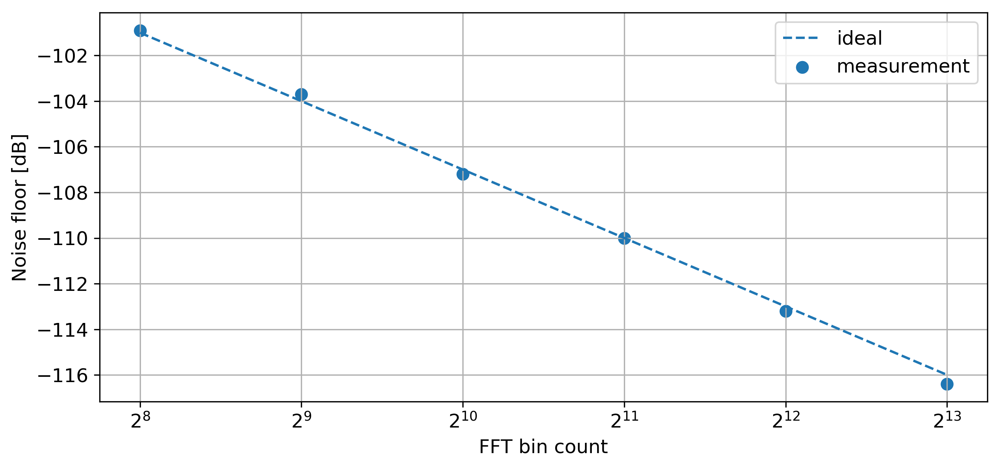

# Thesis Topics

- Applications of Spectrum Monitoring
- Spectrum Sensing Methods
- Software Defined Radio
- System implementation
- Test and measurements

---

---

# Tools & Practicalities

- USRP (Ettus Research/National Instruments)
- GNU Radio
- python (numpy, pandas, matplotlib)
- Jupyter notebooks
    - plenty of detailed notes
    - annotate all the data
- Julia
- Baudline

# Tools & Practicalities

- Started work late December 2016
- Topic not strictly specified
    - Articles from IEEExplore
    - Annotate and save reference material
- Kept all personal deadlines
    - there weren't any other
- Writing and practical work complete

- BibTeX, Git, Rsync, Makefiles
- Lab notebooks

---

---

{ width=100% }

---

{ width=100% }

---

<!-- { width=100% }

--- -->

{ width=100% }

---

{ width=100% }

---

{ width=100% }

---

{ width=100% }

---

<!-- 

--- -->

{ width=100% }

---

# Conclusion

- Fun, interesting and rewarding
- Great tools and workflows
- Very independent work
- Still have some ideas...
- Overall a success
